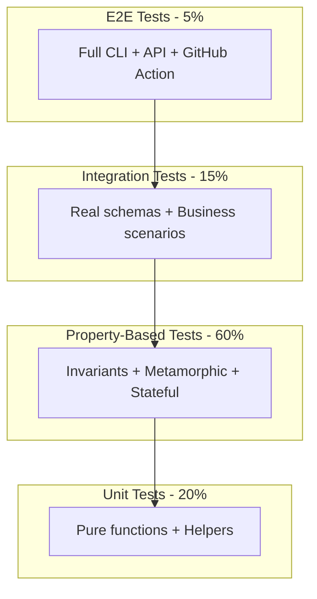
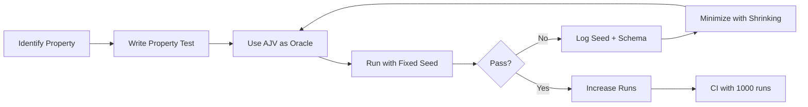

# 🏗️ Testing Architecture & Strategy - FoundryData v2.1

> **Version**: 2.1.0  
> **Date**: 2025  
> **Stack**: TypeScript + Vitest + Fast-check  
> **Goal**: Guarantee 100% schema compliance with deterministic tests  
> **Updates**: Fixed API consistency, enum/const coherence, relaxation completeness

## 📑 Table of Contents

1. [Vision & Principles](#vision--principles)
2. [Testing Architecture](#testing-architecture)
3. [Property-Based Testing Strategy](#property-based-testing-strategy)
4. [Essential Test Patterns](#essential-test-patterns)
5. [Development Workflow](#development-workflow)
6. [Metrics & KPIs](#metrics--kpis)
7. [CI/CD & Automation](#cicd--automation)
8. [Troubleshooting & Debug](#troubleshooting--debug)
9. [Quality Checklist](#quality-checklist)
10. [Resources & References](#resources--references)

---

## 🎯 Vision & Principles

### Testing Mission for FoundryData

**"Ensure every generated data respects its schema 100%, deterministically and performantly, across all JSON Schema drafts."**

### Core Principles

#### 1. **Zero Tolerance Policy** 🚫
```typescript
// ❌ NEVER ACCEPTABLE
expect(complianceScore).toBeGreaterThan(95); 

// ✅ ONLY ACCEPTABLE
expect(complianceScore).toBe(100);

// Use AJV as the source of truth with strict validation
const ajv = getAjv(); // allowUnionTypes: false for strict JSON Schema
const validate = ajv.compile(schema);
expect(validate(data)).toBe(true);
```

#### 2. **Determinism First** 🎲
- Fixed seed (424242) by default, not `Date.now()`
- No shuffle in CI (`shuffle: false`)
- No retries for PBT (`retry: 0`)
- Same seed → Same output → ALWAYS
- Note: Vitest `sequence.seed` doesn't reseed fast-check, use `fc.configureGlobal`

#### 3. **Performance as Realistic Targets** ⚡
- `< 0.5ms` per simple item (p95)
- `< 2ms` per complex object (p95)
- `< 20ms` per nested structure (p95)
- Use percentiles, not averages
- Platform-specific tolerances

#### 4. **Property Over Example** 🔄
- Favor universal properties over specific cases
- 1 property test > 100 example tests
- Focus on business invariants
- Use AJV as oracle for validation
- Format assertion (not just annotation) is enforced

---

## 🏛️ Testing Architecture

### Project Structure

```
foundrydata/
├── packages/
│   └── core/
│       ├── src/
│       │   ├── generators/
│       │   │   ├── string-generator.ts
│       │   │   └── string-generator.test.ts    # Co-location
│       │   └── validators/
│       │       ├── compliance-validator.ts
│       │       └── compliance-validator.test.ts
│       └── __tests__/                          # Integration tests
│           └── integration/
└── test/                                        # Global tests
    ├── arbitraries/                            # Fast-check generators
    │   ├── json-schema.ts                     # Draft-aware arbitraries
    │   └── business.ts
    ├── fixtures/                               # Test data
    ├── helpers/                                # Utilities
    │   └── ajv-factory.ts                     # AJV by draft
    ├── matchers/                               # Custom Vitest matchers
    ├── patterns/                               # Pattern tests
    │   ├── invariant-testing.test.ts
    │   ├── metamorphic-testing.test.ts
    │   └── stateful-testing.test.ts
    ├── performance/                            # Benchmarks
    ├── setup.ts                                # Global config
    ├── global-setup.ts                         # Before all tests
    └── global-teardown.ts                      # After all tests
```

### FoundryData Test Pyramid (Adapted)



### Multi-Draft Support Strategy

```typescript
// Environment-based draft selection
export type JsonSchemaDraft = 'draft-07' | '2019-09' | '2020-12';

// AJV Factory Pattern
const ajv = createAjv(draft);

// Arbitrary Factory Pattern
const schemaArb = jsonSchemaArbitraryFor(draft);

// CI Matrix Testing
matrix:
  schema-draft: ['draft-07', '2019-09', '2020-12']
```

---

## 🔬 Property-Based Testing Strategy

### Configuration Strategy

```typescript
// Fixed seed for reproducibility
const DEFAULT_SEED = 424242;

// Environment-driven configuration
const seed = process.env.TEST_SEED ? parseInt(process.env.TEST_SEED) : DEFAULT_SEED;
const numRuns = process.env.FC_NUM_RUNS ? parseInt(process.env.FC_NUM_RUNS) : (isCI ? 1000 : 100);

// Log for debugging
console.log(`🌱 Fast-check: seed=${seed}, runs=${numRuns}`);

// Apply globally
fc.configureGlobal({ seed, numRuns });
```

### Arbitrary Design Principles

#### 1. **No Contradictions**
```typescript
// ✅ GOOD: Consistent bounds and valid enum/const
const bounds = createBounds(0, 1000);
bounds.chain(([min, max]) => {
  const validGen = fc.string({ minLength: min, maxLength: max });
  return {
    minLength: fc.constant(min),
    maxLength: fc.constant(max),
    enum: fc.option(fc.array(validGen, { minLength: 1 })), // Valid values only!
    const: fc.option(validGen), // Respects constraints!
  };
});

// ❌ BAD: enum/const can violate constraints
{
  minLength: 10,
  maxLength: 20,
  enum: ['a', 'bb'], // Invalid! Too short
}
```

#### 2. **Draft-Aware Generation**
```typescript
// Draft-07 uses dependencies
if (draft === 'draft-07') {
  schema.dependencies = {...};
}
// 2019-09+ uses dependentRequired/dependentSchemas
else {
  schema.dependentRequired = {...};
  schema.dependentSchemas = {...};
}
```

#### 3. **Required ⊆ Properties**
```typescript
// Ensure required fields exist in properties
const propKeys = Object.keys(properties);
const required = fc.shuffledSubarray(propKeys);
```

---

## 🎭 Essential Test Patterns

### 1. Invariant Testing (Most Critical)

**Principle**: Properties that must ALWAYS be true

```typescript
describe('Critical Invariants', () => {
  it('MUST maintain 100% schema compliance', () => {
    const ajv = getAjv(); // Singleton, cached
    
    return propertyTest(
      'Critical invariants: AJV compliance',
      fc.property(
        getSchemaArbitrary(), // Draft-aware
        seedArbitrary,
        (schema, seed) => {
          const data = generate(schema, seed);
          const validate = ajv.compile(schema); // Cached compilation
          
          // Use AJV as oracle
          if (!validate(data)) {
            console.error('Schema:', schema);
            console.error('Seed:', seed);
            console.error('Errors:', validate.errors);
            throw new Error('COMPLIANCE VIOLATION');
          }
        }
      ),
      { parameters: { numRuns: fc.readConfigureGlobal().numRuns } }
    );
  });
});
```

**Critical Invariants for FoundryData**:
- ✅ Compliance = 100% (via AJV)
- ✅ Perfect determinism (fixed seed)
- ✅ Correct types
- ✅ Respected constraints
- ✅ Performance < realistic thresholds

### 2. Metamorphic Testing

**Principle**: Relations preserved under transformations

#### Fixed Schema Relaxation
```typescript
function relaxSchema(s: any, draft: JsonSchemaDraft): any {
  // Handle arrays (tuples in draft-07)
  if (Array.isArray(s)) {
    return s.map(x => relaxSchema(x, draft));
  }
  
  // Remove all constraints
  delete s.minimum;
  delete s.minLength;
  delete s.uniqueItems;
  
  // CRITICAL: Remove unevaluated* for 2019-09+
  if (draft !== 'draft-07') {
    delete s.unevaluatedItems;
    delete s.unevaluatedProperties;
  }
  
  // Handle prefixItems for 2019-09+
  if (draft !== 'draft-07' && s.prefixItems) {
    s.prefixItems = s.prefixItems.map(item => relaxSchema(item, draft));
  }
  
  // Recursively relax nested schemas
  // ... etc
}
```

#### Prefix Stability
```typescript
// Generate with same seed should have stable prefix
const all = generate({ schema, count: n1 + n2, seed });
const part1 = generate({ schema, count: n1, seed });

// Prefix must match
expect(JSON.stringify(all.slice(0, n1))).toEqual(JSON.stringify(part1));
```

### 3. Oracle Testing

**Principle**: AJV as the reference implementation

```typescript
it('should match AJV validation', () => {
  return propertyTest(
    'Oracle consistency: AJV vs internal',
    fc.property(schema, data, (s, d) => {
      const ajvResult = ajv.compile(s)(d);
      const ourResult = ourValidator.validate(d, s);
      expect(ourResult).toBe(ajvResult);
    })
  );
});

// Note: FoundryData wraps fast-check via propertyTest to standardize timeouts,
// shrinking logs and failure context (seed, numRuns). Prefer propertyTest over fc.assert.
```

### 4. Stateful Testing

**Principle**: Consistency through operation sequences

```typescript
// Model-based testing with state tracking
const model = {
  cache: new Map(),
  metrics: { generated: 0, validated: 0 }
};

// Commands modify both system and model
// Invariants compare them
expect(system.getCacheSize()).toBe(model.cache.size);
```

### 5. Chaos Testing

**Principle**: Graceful error handling

```typescript
fc.property(
  fc.anything(),
  (chaosInput) => {
    // Should not throw, but return error
    const result = generator.safeGenerate(chaosInput);
    expect(result.ok).toBeDefined();
    if (!result.ok) {
      expect(result.error).toBeInstanceOf(ValidationError);
    }
  }
);
```

---

## 🔄 Development Workflow

### TDD with Property-Based Testing



### Debug Process

1. **Failure detected** → Seed logged automatically
2. **Local reproduction**:
   ```bash
   TEST_SEED=424242 FC_NUM_RUNS=1 npm test -- --grep "failing test"
   ```
3. **Shrinking** → Minimal case found
4. **Fix** → Add to regression suite
5. **Verification** → 1000+ runs without failure

### Environment Variables

| Variable | Description | Default |
|----------|-------------|---------|
| `TEST_SEED` | Fast-check seed | 424242 |
| `FC_NUM_RUNS` | Number of runs | 100 (local) / 1000 (CI) |
| `SCHEMA_DRAFT` | JSON Schema version | 2020-12 |
| `PERF_LOG` | Enable performance logs | false |
| `DEBUG` | Verbose output | false |

---

## 📊 Metrics & KPIs

### Quality Metrics

```typescript
interface QualityMetrics {
  // Coverage
  lineCoverage: number;        // Target: 90%
  branchCoverage: number;      // Target: 85%
  functionCoverage: number;    // Target: 90%
  
  // Compliance (via AJV)
  complianceScore: 100;        // ALWAYS 100
  ajvValidationRate: 100;      // ALWAYS 100
  
  // Performance (Realistic)
  p50GenerationTime: number;   // <0.3ms/item
  p95GenerationTime: number;   // <0.5ms/item
  p99GenerationTime: number;   // <2ms/item
  
  // Determinism
  seedReproducibility: 100;    // ALWAYS 100
  
  // Tests
  propertyTestsRatio: number;   // >60% of tests
  flakyTests: 0;               // ALWAYS 0 (no retries)
}
```

### Health Dashboard

```
┌─────────────────────────────────────────┐
│         FOUNDRYDATA TEST HEALTH         │
├─────────────────────────────────────────┤
│ ✅ Compliance (AJV):        100%        │
│ ✅ Test Coverage:           92.3%       │
│ ✅ Property Tests:          156         │
│ ✅ P50 Generation:          0.3ms       │
│ ✅ P95 Generation:          0.5ms       │
│ ✅ Memory Stable:           Yes         │
│ ✅ Deterministic:           100%        │
│ ✅ Draft Support:           3/3         │
│ ✅ Seed:                    424242      │
└─────────────────────────────────────────┘
```

---

## 🚀 CI/CD & Automation

### Test Pipeline

```yaml
name: Test Pipeline

on: [push, pull_request]

jobs:
  quick-tests:
    name: Quick Tests
    runs-on: ubuntu-latest
    timeout-minutes: 5
    steps:
      - name: Property Tests - Quick
        run: npm test
        env:
          FC_NUM_RUNS: 100
          TEST_SEED: 424242
          
  full-tests:
    name: Full Tests
    runs-on: ubuntu-latest
    timeout-minutes: 30
    if: github.ref == 'refs/heads/main'
    strategy:
      matrix:
        schema-draft: ['draft-07', '2019-09', '2020-12']
        node: [18, 20]
        os: [ubuntu-latest, macos-latest, windows-latest]
    steps:
      - name: Property Tests - Full
        run: npm test
        env:
          FC_NUM_RUNS: 1000
          TEST_SEED: 424242
          SCHEMA_DRAFT: ${{ matrix.schema-draft }}
          
  performance:
    name: Performance Benchmarks
    runs-on: ubuntu-latest
    steps:
      - name: Run Benchmarks
        run: npm run bench
        env:
          PERF_LOG: true
      - name: Check Regression
        run: npm run bench:check
```

### Configuration Best Practices

```typescript
// vitest.config.ts
{
  // Platform-specific pool
  pool: process.platform === 'win32' ? 'threads' : 'forks',
  
  // No retries for determinism
  retry: 0,
  
  // Fixed sequence in CI
  sequence: {
    seed: process.env.CI ? 1 : parseInt(process.env.TEST_SEED || '424242'),
    shuffle: !process.env.CI,
    concurrent: false,
  },
}

// AJV configuration - Strict JSON Schema compliance
const ajvOptions = {
  strict: true,
  allErrors: true,
  strictSchema: true,
  allowUnionTypes: false,  // No "string|number" syntax
  validateFormats: true,   // Assert formats, not just annotate
};
```

---

## 🔧 Troubleshooting & Debug

### Common Issues and Solutions

#### 1. Non-Deterministic Tests

**Symptom**: Different results with same seed

**Solution**:
```typescript
// Ensure fixed seed everywhere
const seed = 424242; // Not Date.now()!

// No shuffle in CI
shuffle: false

// No retries
retry: 0

// Log seed always
console.log(`Seed: ${seed}`);
```

#### 2. AJV Performance Issues

**Symptom**: Slow schema compilation

**Solution**:
```typescript
// Use singleton with cache
const ajv = getAjv(); // Cached instance

// WeakMap for compiled schemas
const cache = new WeakMap();
```

#### 3. Schema Contradictions

**Symptom**: Invalid schemas generated

**Solution**:
```typescript
// Use createBounds helper
const [min, max] = createBounds(0, 1000);

// Ensure required ⊆ properties
const required = shuffledSubarray(Object.keys(properties));
```

#### 4. Draft Incompatibilities

**Symptom**: Keywords not recognized

**Solution**:
```typescript
// Use correct AJV version
const ajv = draft === '2020-12' ? new Ajv2020() :
            draft === '2019-09' ? new Ajv2019() :
            new Ajv();

// Use draft-specific keywords
if (draft === 'draft-07') {
  schema.dependencies = ...;
} else {
  schema.dependentRequired = ...;
}
```

### Debug Commands

```bash
# Test with specific seed and draft
TEST_SEED=12345 SCHEMA_DRAFT=2019-09 FC_NUM_RUNS=1 npm test

# Verbose debug mode
DEBUG=* npm test -- --verbose

# Performance profiling
PERF_LOG=true npm run bench

# Single test with logging
npm test -- --grep "test name" --reporter=verbose
```

---

## ✅ Quality Checklist

### Before Each Commit

- [ ] Tests pass with fixed seed (`TEST_SEED=424242`)
- [ ] No `Date.now()` for seeds
- [ ] AJV used as validation oracle
- [ ] No schema contradictions possible
- [ ] Coverage > 80%

### Before Each PR

- [ ] CI green on all matrix combinations
- [ ] All drafts tested (draft-07, 2019-09, 2020-12)
- [ ] Performance within targets (p95)
- [ ] No flaky tests (retry=0)
- [ ] Seed logged in all failures

### Before Each Release

- [ ] 1000+ runs on all property tests
- [ ] All platforms tested (Linux, Mac, Windows)
- [ ] Memory leak tests pass
- [ ] Performance baselines updated
- [ ] Draft compatibility verified

### Property Test Checklist

```typescript
// For each new property test:
✅ Use getSchemaArbitrary() for draft awareness
✅ Use getAjv() singleton
✅ Log seed on failure
✅ No contradictions in arbitraries
✅ Required ⊆ Properties
✅ Handle draft-specific keywords
✅ Use fc.readConfigureGlobal().numRuns
✅ Test with all drafts in CI
```

---

## 📚 Resources & References

### Essential Documentation

- 🔗 [Fast-check Documentation](https://fast-check.dev/)
- 🔗 [Vitest Documentation](https://vitest.dev/)
- 🔗 [JSON Schema Specification](https://json-schema.org/)
- 🔗 [AJV Documentation](https://ajv.js.org/)
- 🔗 [JSON Schema Draft Differences](https://json-schema.org/draft/2020-12/release-notes.html)

### Key Improvements in v2.1

1. **API Consistency**: `generate()` returns array directly, not `{data: array}`
2. **Enum/Const Coherence**: Values respect all constraints (min/max/pattern)
3. **Strict JSON Schema**: `allowUnionTypes: false` for standard compliance
4. **Complete Relaxation**: Includes `unevaluatedItems/Properties` removal
5. **Stable Deep Comparison**: `toBeDistinct` uses sorted key stringify
6. **Format Assertion**: Formats are validated, not just annotated
7. **Clear Semantics**: Vitest seed vs fast-check seed documented
8. **Multi-Draft Support**: Proper handling of draft-07, 2019-09, 2020-12
9. **True Determinism**: Fixed seed (424242), no shuffle in CI, no retries
10. **AJV as Oracle**: Single source of truth for validation
11. **No Contradictions**: Arbitraries guarantee valid schemas
12. **Realistic Performance**: Percentile-based targets with tolerance
13. **Cached Compilation**: WeakMap for schema validators
14. **Platform-Specific**: Pool selection based on OS
15. **Environment-Driven**: All config via env vars

### Migration from v1.0

```bash
# Update your test scripts
export TEST_SEED=424242
export FC_NUM_RUNS=1000
export SCHEMA_DRAFT=2020-12

# Update imports
- import { jsonSchemaArbitrary } from '@arbitraries';
+ import { getSchemaArbitrary } from '@arbitraries';

# Use AJV singleton
- const ajv = new Ajv();
+ const ajv = getAjv();

# No more Date.now()
- seed: Date.now()
+ seed: 424242
```

---

## 🎓 Advanced Principles

### Law of Least Surprise

```typescript
// Predictable defaults
const DEFAULT_SEED = 424242; // Not random!
const DEFAULT_DRAFT = '2020-12'; // Latest stable

// Explicit is better than implicit
console.log(`Using seed: ${seed}`);
console.log(`Using draft: ${draft}`);
```

### Fail Fast, Fail Clearly

```typescript
// Log everything on failure
if (!valid) {
  console.error('❌ FAILURE CONTEXT:');
  console.error('  Schema:', JSON.stringify(schema, null, 2));
  console.error('  Seed:', seed);
  console.error('  Draft:', draft);
  console.error('  Data:', JSON.stringify(data, null, 2));
  console.error('  Errors:', JSON.stringify(errors, null, 2));
  throw new Error('Detailed message here');
}
```

### Performance Realism

```typescript
// Use percentiles, not averages
const p50 = measurements.sort()[Math.floor(length * 0.5)];
const p95 = measurements.sort()[Math.floor(length * 0.95)];

// Platform-aware targets
const target = process.platform === 'win32' ? ms * 1.5 : ms;

// Tolerance for CI variance
expect(p95).toBeLessThan(target * (1 + tolerance));
```

---

## 🚨 Final Golden Rules

### The 10 Commandments of FoundryData Testing

1. **Thou shalt use fixed seed 424242, never Date.now()**
2. **Thou shalt use AJV as the single source of truth**
3. **Thou shalt support all JSON Schema drafts properly**
4. **Thou shalt never generate contradictory schemas**
5. **Thou shalt ensure required ⊆ properties always**
6. **Thou shalt cache compiled validators with WeakMap**
7. **Thou shalt use percentiles for performance targets**
8. **Thou shalt disable shuffle and retry in CI**
9. **Thou shalt log seed and draft on every failure**
10. **Thou shalt test the matrix of drafts × platforms**

### Anti-Patterns to Avoid

❌ **Random Seed**: Using `Date.now()` or `Math.random()`  
❌ **Multiple AJV Instances**: Creating new AJV per test  
❌ **Draft Mixing**: Using 2019-09 keywords in draft-07  
❌ **Contradiction Generation**: `minLength > maxLength` or invalid enum values  
❌ **Invalid Enum/Const**: Enum values that violate constraints  
❌ **Required Orphans**: Required fields not in properties  
❌ **Uncached Compilation**: Recompiling same schema  
❌ **Average Performance**: Using mean instead of p95  
❌ **Retry Masking**: Hiding flaky tests with retries  
❌ **Silent Failures**: Not logging seed/context  
❌ **Single Draft Testing**: Only testing one version  
❌ **API Inconsistency**: Mixing array vs {data: array} returns  
❌ **Unstable Stringify**: JSON.stringify without sorted keys  
❌ **Union Types**: Using non-standard "string|number" syntax  

---

## 🎯 Conclusion

This v2.1 guide incorporates all critical fixes :

- **API consistency** with unified array return
- **Enum/const coherence** respecting all constraints
- **Strict JSON Schema** compliance (no union types)
- **Complete relaxation** including unevaluated*
- **Stable deep comparison** for object equality
- **Determinism** guaranteed with fixed seeds
- **Multi-draft** support with proper factories
- **AJV** as the oracle with caching
- **No contradictions** in generated schemas
- **Realistic** performance targets
- **Environment-driven** configuration

FoundryData's promise of 100% schema compliance is now properly tested and guaranteed across all JSON Schema drafts with complete consistency.

---

*Document version: 2.1.0*  
*Last updated: 2025*  
*Maintainers: FoundryData Team*  
*License: MIT*
